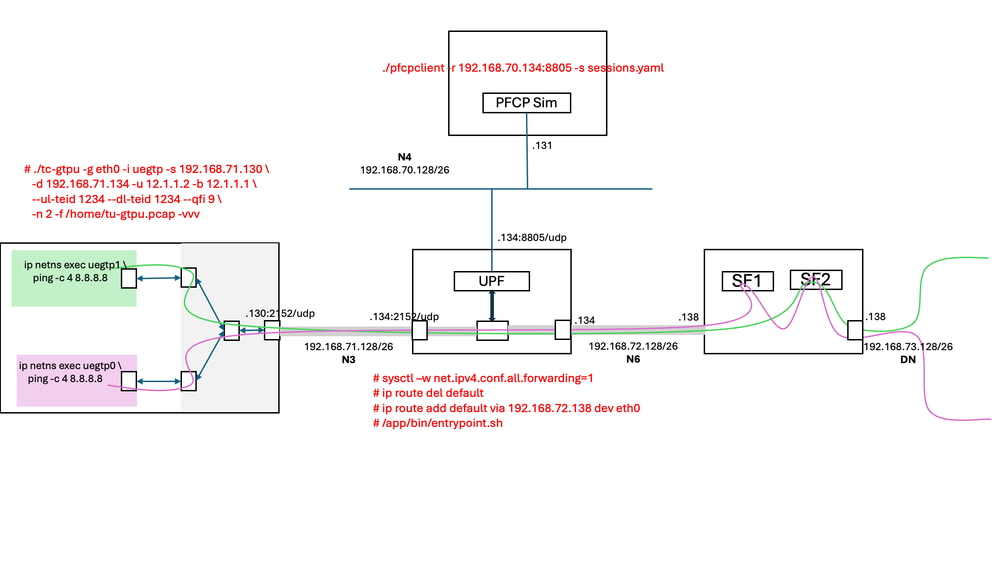

# Open N6-LAN

This project implements the N6-LAN network segment, residing between the UPF (User Plane Function) and the internet, specifically designed to host value-added services or VNFs. The N6-LAN processes traffic received from the UPF before it reaches the internet. The main functionality of the N6-LAN is to steer classified subsets of network traffic to specifically chained network functions (VNFs) for processing, in order to support a desired policy and SLA. This functionality, also referred to as Service Function Chaining (SFC).




## Service Functions (vnfs/)

The N6-LAN consists of the following service functions:
* [vCache](vnfs/cache-squid/README): This service leverages the open-source [Squid](https://www.squid-cache.org) software to provide a virtual cache functionality
* [vIPS](vnfs/ips-suricata/README): This service functions as a virtual Intrusion Prevention System (IPS) utilizing the open-source [Suricata](https://suricata.io) software.

To set up each service function, follow the instructions in the respective README file.

## Get Started

This setup utilises Docker and Docker Compose for deployment. Ensure you have them installed before proceeding.

### Instructions

```bash
# Clone repo
git clone https://github.com/tariromukute/OpenN6LAN.git
# Navigate to project directory
cd OpenN6LAN
```

**Run the services**:
* [eUPF](https://github.com/edgecomllc/eupf) for the 5G Core data plane
* [PFCP Simulator](https://github.com/infinitydon/pfcp-kitchen-sink) for emulating the PFCP message setting up session
* [UE Sim](https://github.com/tariromukute/tc-gtpu.git) emulating User Equipment (UE) devices
* [N6-LAN](https://github.com/tariromukute/OpenN6LAN): For steering the traffic through service functions.

```bash
cd docker-compose
docker-compose -f docker-compose-eupf.yaml up -d
```

## Building project

### Build docker image

Use this command to build eupf's docker image: `docker buildx build --platform=linux/amd64 -t local/openn6lan-ovs:latest -f docker/Dockerfile.openvswitch .`

## Contribution

Please create an issue to report a bug or share an idea.
